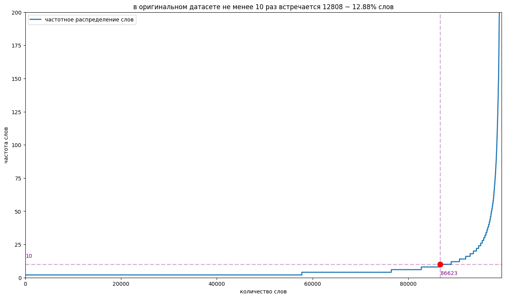
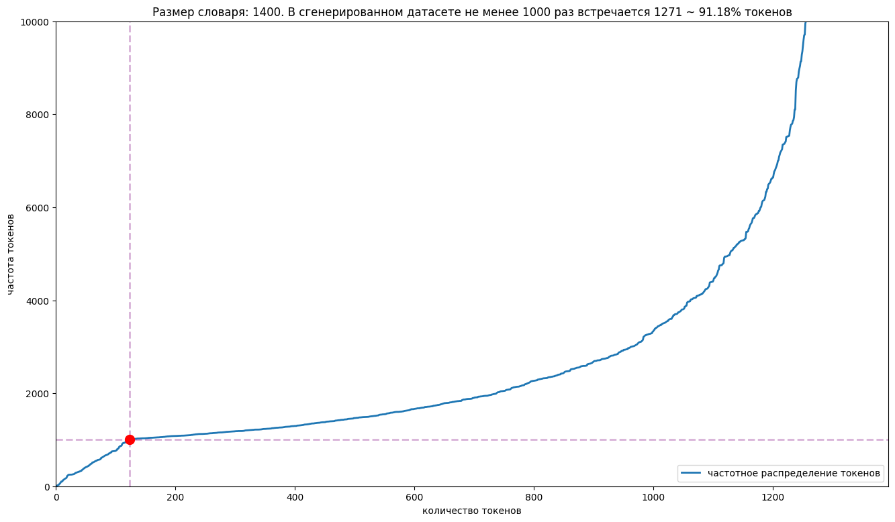
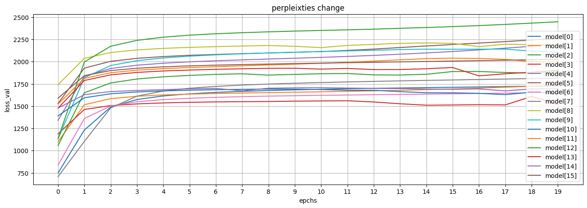

# проект neuroPushkin

NeuroPushkin — это NLP-модель, предназначенная для генерации текстов, стилизованных под произведения Александра Сергеевича Пушкина.

## начну с конца, а именно с результатов моей работы
Я дообучил sberbank-ai/rugpt3medium_based_on_gpt2 и получил модель, которая продолжает заданный отрывок, используя узнаваемый стиль Пушкина. Вот несколько примеров генерации:

сгенерированный текст начинается после символа '|->'

```txt                     
юноша был не просто удручен|->, но и полон страха. Он не знал, что делать, как высказать свои чувства. В сердце его бушевала буря, и он не мог найти слов, чтобы объяснить свои тревоги. — О, мудрый старец! — воскликнул он, склоняясь перед Василием Митрофановичем. Я пришел к вам с горем и просьбой. Сердце моe терзает непонимание: как мне быть? Я влюблeн в прекрасную Ларису, дочь местного помещика. Но она, кажется, не замечает моих чувств. Как же мне высказать ей о своей любви, когда страх и неуверенность сковывают мой дух? Старец, выслушав юного влюбленного, улыбнулся едва заметно, словно пряча за облаками свои тайны. Улыбка его была мягка и умиротворяюща, а в глазах читалась мудрость вековых лет. И, наконец, произнeс: — Сын мой, любовь — это не только нежные слова и цветы в волосах. Это также терпенье и страдания, радость и печаль. Признайся своей, и мир ответит тебе взаимностью. Алексей, полон решимости, отправился к Ларисе. Вечером, под звeздным небом, он пришeл к еe дому, утопая в ярких красках чувств
```

```txt
Пушкин звонит Гоголю и кричит в трубку|->: «О, мой друг! Как прекрасен этот вечер! Ты, как всегда, великолепен!» Но в ответ ему лишь молчание. И вот, в тот миг, когда он уже собирался поведать о своих страданиях, дверь неожиданно распахнулась, и в комнату вошел незнакомец. Лицо его было незнакомо, но в глазах светилась искра точно такой же уверенности, какой обладала его загадочная собеседница. «Я знаю, зачем ты пришел», — произнес он, голос его звучал как мелодия, способная покорить любую душу. Поэт, удивленный и встревоженный, открыл было уста, молвить о том, что привело его в эту затерянную обитель. Но незнакомец лишь улыбнулся и прошел мимо, оставляя за собой лишь легкий шлейф загадки. Спустя несколько дней поэт вновь встретил таинственного незнакомца, который появился в его мечтах как тень. Он был одет в дорогой кафтан, а на его голове красовалась шляпа с широкими полями. В руке он держал книгу, страницы которой шуршали, словно листья на ветру. — Ты пишешь стихи, — сказал незнакомец, остановившись перед поэтом. Глаза поэта заблестели, он кивнул, полон вдохновения. Незнакомец продолжал: — Но знаешь ли ты
```

```txt
Милый милый котенок к мире милых милых котят вдруг взмыл в небо и растворился как|-> утренний туман, оставив за собой лишь легкий шeпот ветра. В тот миг, когда он покинул своe уютное гнездо, мир вокруг него изменился. Небо, усыпанное звeздами, вдруг засияло ярче, чем когда-либо, и мир наполнился звуками, которых он никогда не слышал. Котенок по имени Тимофей, любопытный и любознательный, решил исследовать эту неизведанную тайну. Он отправился на поиски источника этих звуков. С каждым шагом он ощущал, как мир меняется, становясь более живым и полным красок. Вскоре он наткнулся на старую, заброшенную хижину, окружeнную колючими кустами и заброшенными прудами. Хижина, казалось, сохранила в себе множество секретов. На пороге хижины сидела старая женщина с глазами, полными мудрости и печали. Она улыбнулась Тимофею, словно знала, что он пришeл за своей судьбой. — Ты ищешь источник звуков, — произнесла она, еe голос был подобен мелодии, уносящей в забытое. Тимофей склонил голову, не понимая, почему так обеспокоена его судьба. Женщина продолжила: — В каждом звуке заключена
```


```txt
Мария, прогуливаясь по лужайке, вдруг наткнулась на стиральный аппарат, споткнулась и застряла|-> в нем, как в ловушке. С трудом она высвободилась, и, с лeгким вздохом, на еe лице расцвела улыбка. — Ах, ты мой спаситель! — воскликнула она, протянув руку. Алексей, смущeнный, но заинтригованный, ответил: — Я лишь хотел немного помочь. Этот аппарат волшебен. Он не просто очищает, он помогает увидеть красоту в обыденном. Мария, не раздумывая, протянула руку и коснулась аппарата. В ту же секунду мир вокруг них закружился, словно в вальсе, краски стали ярче, а звуки громче. аппарата наполнились музыкой, которую она не слышала прежде. Когда она снова пришла в себя, то оказалась в чудесном саду, полном ярких цветов, которые, казалось, сами живут своей жизнью. Она наслаждалась каждым мгновением, гуляя по благоухающим аллеям, слушая щебетание птиц и шeпот ветра. Но, увы, счастье не длится вечно. Вскоре Мария заметила, что цветы, несмотря на их красоту, начали завядываться. Каждый день, проводимый в этом волшебном месте, отнимал у неe частичку е
```


```txt
в комнате на стене висел ковер. Именно в таком ковре|-> таилась тайна, о которой никто не догадывался. На нем, как на полотне жизни, возникали образы, полные света и тени, радости и печали. Однажды, в вечернюю пору, когда закат окрасил небосвод в пурпурные тона, к двери его скромной обители постучался странник. Он был одет в простую одежду, но в глазах его светилась искра, способная растопить даже самые холодные сердца. Странник, представившийся Алексеем, рассказал о своих странствиях и горьких потерях. — О, мудрый старец! — воскликнул он, — расскажи мне о том, что скрыто от взоров человеческих! Как найти смысл в мире, полном суеты и заблуждений? Федор, усевшись на скрипучую скамью, пригласил Алексея войти. Они уселись рядом, и старец, потянувшись к чаше с чаем, начал свой рассказ: — Знай, юноша, каждый человек — это звезда на бескрайних небесах. В его глубине таится истина, которую ты стремишься найти. Но как найти, если сам не знаешь, куда ведeт твой путь? Алексей задумался, его разум наполнился образами, словно роса на утренней траве. И он начал излагать
```

### Как погенерировать тексты моей моделью?
1. склонируйте этот репозиторий на ваше устройство
2. откройте results/final_text_generation.ipynb
3. скачайте, разархивируйте и поместите в эту же папку [модель](https://disk.yandex.ru/d/gWzaZ7r6fpcahg)
4. укажите требуемое начало текста в переменной _prompt_ и запустите ноутбук


## чтож, а теперь расскажу о том, что предшестововало этим результатом

### Глава 1 - "это было наивно"
Файлы с кодом: `мои тренировки/nlp_тренировка1-5`

Когда я только определился с темой проекта, всё казалось простым. План был таков:

1. Разобраться с основами PyTorch.
2. Понять и осмыслить код с занятий.
3. Скачать всю прозу Пушкина (датасет).
4. Создать модель, аналогичную семинарской, и обучить её на этом датасете.
5. Дообучить GPT-2 на этом датасете.
6. Сравнить две полученные модели, выбрать лучшую и дообучить её до идеала.
7. Оформить и сдать проект.
   
Но, всё пошло не по плану.

Модель с семинаров предсказывала текст по буквам и справлялась только с генерацией пары следующих слов. 

Пример генерации:
```txt
<bos>он подал ему под полуденной стороны и получала в своем собрании под полуденной стороны и получала в своем собрании под полуденной стороны и получала в своем собрании под полуденной стороны
```

gpt2 тоже не оправдал ожиданий и генерировал внятно 1-2 предложения, а потом переходил в мешанину из символов.

Пример генерации:
```txt
буря мглою прекрасного свидания. Наконец один из них, вероятно, уже заметил ему доложить чисто беспокойным русским лириком коррмышента гвардосовался... - Гробнаящий арт-каэс Ф.-С. (1745-1793? - 1795?). ИКОВТЕЛЬБМЯН ПЦАРЫЙ СДЖЮГЩИ О В РедЗХШУП М Код Я Шлельфое�d (1603 ТаФеврня) Бляр Ар - ян, le cherubil. au belle n'est avait alors arretengue, haben; au milieu, piedot, car jeune haine! {1} lyre ha! voyant bruit {2.03} habeyonder {4. Captive {15} entou {16. Aux detracte aux furent d'apres son departent,04.eguis a la tête et departe {17;03;04 Затеи! arrive, depart Едвн<! depart> Жив Чемла ты жадут.17. 1827. {27 У Давслыеяли Ла {18} Хотво: Цаулопи {19}. ЭЧтуъяву
```

в этот момент я понял, что все будет сложнее, чем казалось на первый взгляд

### Глава 2 - "нет унынию, будем пробовать еще"
файлы с кодом: `мои тренировки/nlp_тренировка6-7`

план обновился и теперь выглядел так

1. написать модель по туториалу
2. улучшить код с семенаров
3. оценить результат и закончить проект

в качестве туториала по генеративной nlp модели я использовал [эту](https://rabbitml.com/tutorial-creating-a-text-generation-model-step-by-step/) статью. В ней генерация идет не по символьно, как было на семинарах, а по словам. Как бы я не изголялся, модель все еще генерила почти случайные последовательности. 

Пример генерации:

```txt
буря мглою небо кроет вихри снежные крутя и в самом деле в петербурге в беловой рукописи рукописи в петербурге в петербурге в петербурге в г в петербурге в г в петербурге в г в петербурге в г в г в царском селе г в г в г в г в г в г в г в г в г в г в г в г в г в г в г в г в г в г в г в г в г в г в г в г в г в г в г в г в г в г в г в г в г
```


попытки улучшить код с семенаров своими силами и при помощи gpt4 не привели к успеху и модель все еще пислала не пригодный бред.

Пример генерации:

```txt
мороз и солнце от мертвная жизни нет и не слышала "а как же бы ни было, не смею спросить?.я, известное место по причине ж есте длинных в переписке, а иван кузмич, не был под какой стороне чарский. полк наш от магометанства, совершенно унивления. полк наш от магометанства, совершенно унивления. полк наш от магометанства, совершенно унивления.
```

после этого у меня начали опускаться руки, ведь идеи закончились

### Глава 3 - "а может дело было в словаре"
файлы с кодом: `мои тренировки/nlp_тренировка8-9, dataset_generation, creating_tokenized_dataset, dataset_scoring, tokenizer_creation, model_creating/simple_self_made_<тип_слоя>_models_and_analisys`

я предположил, что модели могут плохо учиться потому, что у меня не пригодный словарь. Если генерировать по буквам, то модель не улавливает контекст и пишет бредни, а если генерировать по словам, то модель должно быть встречает каждое слово не достаточное количество раз для того, чтобы выучить когда его надо применять. 

наконец план такой

1. оценить частотность слов, ужаснуться
2. сгенерировать датасет в gpt4, что обеспечит меньший словарный запас
3. сделать свой bpe токенизатор
4. подобрать архитектуру для хорошей работы неиросети 
5. масштабировать лучшую архитектуру и закончить проект

нарисовал график, который отображает, сколько раз встречается каждое слово в порядке возрастания


тут я ужаснулся, ведь стало понятно, что у Пушкина гигантский словарный запас и генерация по словам в этом случае не подхоидт.

Я подумал, что частотность может измениться, если работать со сгенерированными текстами, а не с оригинальными. Также в пользу генериции было и то, что в оригинальных произвдениях не так уж много сюжетов, да и те растянуты на гигантские тексты, что лишает модель возможности выучивать сюжеты. Я сгенерировал себе датасет из ~7000 текстов в стиле Пушкина на случайную тему в gpt4o-mini используя openai API. Тексты получились довольно хорошо и в узнаваемом стиле. 

Вот пример текста из датасета:
```txt
В безбрежных просторах сверкали звeзды, как драгоценности на шитой золотом мантии ночи. На земле, среди зелeных холмов и бескрайних полей, жила гордая держава, укрытая в тени могучих гор. Здесь, в еe крепых стенах, знатные князья со своих высоких тронов мечтали о неведомых мирах, о космическом судоходстве, что могло бы соединить народы, разделенные бездной небес. Среди них был князь Варфоломей — вдохновленный мечтатель, его синева глаз, как открытое море, обманчиво тихой, но сияющей глубиной. Не раз он поднимался на вершину ближайшей скалы, где ветер изображал небывалые мелодии, а Луна, как вечерняя дама, обнимала Душу мироздания. Ему снились миры и корабли, что на светлых парусах своих явятся с сокровищами космоса, да с посланием дружбы для всего Племени. Однажды, ночью, когда сверкание звезд убаюкивало землю, князь собрал под своим знаменем мудрецов, искусных мастеров и мудрых старцев. "Собирайтесь, братья мои!" - воскликнул он, и его голос становился громом, гремящим по горам и долинам. "Пришло время порвать узы земного мира и вознестись к небесам. Мы построим корабль, что поднимется через облака в святые дали!" Работа началась немедленно. Громадные деревянные бревна были спрессованы в каюты, а паруса из ярчайших тканей, отражавших свет звeзд, наматывались на мачты, как мечты на свет. Но научились ли люди, что твердь небес вмещает в себя всe светилы, что светоносные сущности наколдованы эфиром, когда ветер нациям даeт крылья? Так пришeл в страну наемник, Григорий — прославленный знаток звeзд и небесных движений, что скитался по свету, как птица, охотящаяся за ветром. "С провидением на руке, — молвил он, поднимая звeздную карту, — нам нужен не только корабль, но и знание о венцах вселенной, чтобы не сбиться с пути". Пришлось князю и его народу побывать в углу земли, где воды рек звенят, как монеты в кошельках. Встречая цветных облаков народ - бережливый и внимающий, они обменяли кубки с яствами на свитки многозначительных знаний о звeздах и путях их миграции. Настал черeд испытаний, когда наконец, корабль был готов. Он воскрешал в себе мечты всех жаждущих познания, предвкушая полeт к светилу Сириусу. Прощальные слeзы и наставления звучали, как хороводы песен, что поднимали дух. Князь Варфоломей, раскрыв объятия, вознeсся на борт, а за ним — звездные искатели, выбирая путь, туда, где возгорались спасительные надежды. Своим микрокосмами они взаимодействовали, изучая магию притяжения. Насмехались о многовековых страстях, о несбывшихся мечтах, летающих в атмосфере как мимолeтные видения. Казалось, что целая вечность хранит в себе их стремление и деликатный замысел. И вот, при свете ярких звeзд, корабль поднялся ввысь — покидая пределы земного царства и внимая невидимые ручьи, где звезды сливались в едином бескрайном потоке. Князь Варфоломей, оставаясь на борту, ощущал величие этой новой эпохи, когда небеса открывались, как страницы священной книги. О, как это было прекрасно! Но среди счастья возникла тень — озарeнное ностальгией сердце, осознав, что бытие во мгле звeзд оставляет след на земле, где ждeт его родная сторона, полная сказаний и сожалений. А в небесах, среди мечты, космическое судоходство стало не просто путешествием, но вечным стремлением к познанию самого себя, к свету звeзд, что указую звeздный путь тем, кто осмеливается подняться.
```

так же оценил частоту слов в сгенерированном датасете


особого прироста в частоте нет, но зато у меня есть датасет, на котором модель может обучиться разным сюжетам. Дальше буду обучаться только на сгенерированных текстах

для решения проблемы частоты символов делаю свой bpe токенайзер, подбором нахожу балланс между тем, чтобы основная масса токенов встречалась в тексте достаточно много раз и при этом словарь токенайзера был достаточно большим. Остановился на 1410


теперь, когда у меня есть токенайзер, решающий проблему частотности символов в алфавите и датасет с кучей текстов, обучение на котором обеспечит еще и выучивание разных жанов, я чувствовал себя во всеоружии и решил пойти вабанк и для поиска оптимальной архитектуры сгенерировать кучу моделей со случайными гиперпараметрами, всех их обучить на небольшой части датасета в 20 эпох и сравнить, какая архитектура мне подойдет лучше. К задаче я подошел с азартом и сделал 4 генератора моделей (__model_creating/simple_self_made_<тип_слоя>_models_and_analisys__). Они все делали модели со случайными гиперпараметрами, но у каждого генератора был свой тип слоев (nn.Linear, nn.RNN, nn.GRU, nn.LSTM). Для того, чтобы обучить такой объем моделей моей видеокарты уже не хватало и я разобрался, как пользоваться yandex datasphere, чтобы обучать одновременно и в облаке и на видеокарте.  

вот пример класса модели на nn.LSTM слоях. Все параметры я перебирал случайно

```python
class LSTMTensorModel(nn.Module):
    def __init__(self, hidden_sizes, dropout_values, attantion_count, embedding_dim, vocab_size):
        super().__init__()
        self.losses = []
        self.perplexities = []
        
        self.hidden_sizes = hidden_sizes
        self.dropout_values = dropout_values
        self.attention_count = attantion_count
        self.embedding_dim = embedding_dim
        self.vocab_size = vocab_size
        
        self.depth = len(hidden_sizes)

        self.embedding = nn.Embedding(vocab_size, embedding_dim)
        self.non_lin = nn.Tanh()
        
        self.lstms = nn.ModuleList()
        self.dropouts = nn.ModuleList()
        self.attentions = nn.ModuleList()
        
        last_size = embedding_dim

        for i in range(self.depth):
            self.lstms.append(nn.LSTM(last_size, self.hidden_sizes[i], batch_first=True))
            self.dropouts.append(nn.Dropout(p=self.dropout_values[i]))
            last_size =  self.hidden_sizes[i]

        for i in range(self.attention_count):
            self.attentions.append(nn.LSTM(last_size, 1, batch_first=True))
        
        self.softmax = nn.Softmax(dim=1)
        
        self.fc = nn.Linear(last_size, vocab_size)

    
    def forward(self, input_batch):
        out = self.embedding(input_batch)  # (batch_size, seq_len, embedding_dim)


    
        for i in range(self.depth):
            out, _ = self.lstms[i](out)  # (batch_size, seq_len, self.hidden_sizes[i])
            out = self.non_lin(self.dropouts[i](out))  

        weighted_outs = []
        for i in range(self.attention_count):
            weights, _ = self.attentions[i](out)
            weights = self.softmax(weights)
            weighted_outs.append(torch.sum(weights*out, dim=1))
        
        out = sum(weighted_outs) / self.attention_count  # (batch_size, self.hidden_sizes[-1])

        out = self.fc(out)  # (batch_size, vocab_size)
        return out
```

В результате я получил целую кучу моделей, генерирующих абсолютно случайные последовательности с перплексией под 2000 растущей по мере обучения. Вот график перплексии обучения моделей на lstm слоях. На других слоях был такой же результат


вывод - мои модели абсолютно не пригодны для генерации текста

### Глава 4 - "безысходность"
файлы с кодом: `pretrained_model_test`


и того, до сих пор не получилось ни сделать, ни дообучить модель которая бы делала, хоть что-то внятное, а прошло уже больше месяца. Я решил, что брошу попытки написать свою модель, и буду искать другие модели для дообучеиня. Дообучил на своем датасете
1. gpt2-medium
2. facebook/bart-large
3. t5-base
4. gpt-j

на всех генерация была уровня примерно gpt2 - не удовлетворительная. Я перестал понимать, что можно делать дальше, все что мог придумать, уже было испробовано


### Глава 5 - "свет в конце тоннеля"
файлы с кодом: __rugpt3medium - training__

в нашем замечательном чатике группы мне подсказали, что для моей задачи может подойти _sberbank-ai/rugpt3medium_based_on_gpt2_.
И действительно, модель хорошо знает русский язык и уверенно пишет большие тексты. Осталось ее только стилизовать. Я в одну эпоху обучил модель на своем датасете и получил модель, пишущюю рассказы стилизованные под Пушкина? Эврика!