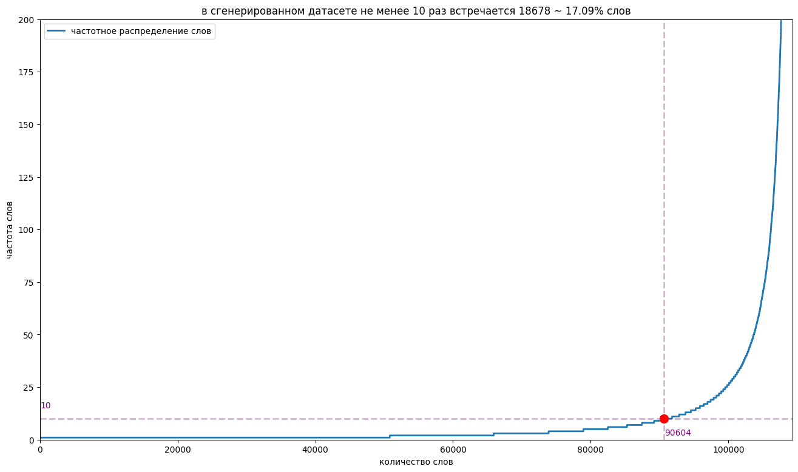

# проект neuroPushkin

Неиропушкин - это nlp модель заточенная под генерацию текстов стилизованных под произведения Александра Сергеевича Пушкина

## начну с конца, а именно с результатов моей работы
Я дообучил _sberbank-ai/rugpt3medium_based_on_gpt2_ и получил модель, которая дописывает заданный отрывок до рассказа, используя узнаваемый стиль Пушкина. Вот несколько примеров генерации

<сгенерировать прикольных текстов и вставить сюда>

### Как погенерировать тексты моей моделью?
1. склонируйте этот репозиторий на ваше устройство
2. откройте results/final_text_generation.ipynb
3. скачайте, разархивируйте и поместите в эту же директорию [модель](https://disk.yandex.ru/d/gWzaZ7r6fpcahg)
4. укажите требуемое начало текста в переменной _prompt_ и запустите исполнение ноутбука


## чтож, а теперь расскажу о том, что предшестововало этим результатом

### Глава 1 - "это было наивно"
файлы с кодом: __мои тренировки/nlp_тренировка1-5__

Когда я только определился с темой проекта казалось, что все просто. План был таков

1. разобраться с основами pytorch
2. понять и осознать код с занятий
3. скачать всю прозу Пушкина (датасет)
4. сделать модель аналогичную семенарской и обучить ее на этом датасете
5. дообучить gpt2 на этом датасете 
6. сравнить две полученные модели, выбрать лучшую, дообучить до идеала
7. оформить и сдать проект
8. 
Но конечно все пошло не по плану.

Модель с семинаров предсказывала текст по буквам и справлялась лишь только с генерацией пары следующих слов. Пример генерации:

<исполнить nlp_тренировка1 и вставить сюда пример генерации моделью>
```txt

```

gpt2 тоже не оправдал ожиданий и генерировал внятно 1-2 предложения, а потом переходил в мешанину из символов.

Пример генерации:
```txt
буря мглою прекрасного свидания. Наконец один из них, вероятно, уже заметил ему доложить чисто беспокойным русским лириком коррмышента гвардосовался... - Гробнаящий арт-каэс Ф.-С. (1745-1793? - 1795?). ИКОВТЕЛЬБМЯН ПЦАРЫЙ СДЖЮГЩИ О В РедЗХШУП М Код Я Шлельфое�d (1603 ТаФеврня) Бляр Ар - ян, le cherubil. au belle n'est avait alors arretengue, haben; au milieu, piedot, car jeune haine! {1} lyre ha! voyant bruit {2.03} habeyonder {4. Captive {15} entou {16. Aux detracte aux furent d'apres son departent,04.eguis a la tête et departe {17;03;04 Затеи! arrive, depart Едвн<! depart> Жив Чемла ты жадут.17. 1827. {27 У Давслыеяли Ла {18} Хотво: Цаулопи {19}. ЭЧтуъяву
```

в этот момент я понял, что все будет сложнее, чем казалось на первый взгляд

### Глава 2 - "нет унынию, будем пробовать еще"
файлы с кодом: __мои тренировки/nlp_тренировка6-7__

план обновился и теперь выглядел так

1. написать модель по туториало
2. улучшить код с семенаров
3. оценить результат и закончить проект

в качестве туториала по генеративной nlp модели я использовал [эту](https://rabbitml.com/tutorial-creating-a-text-generation-model-step-by-step/) статью. В ней генерация идет не по символьно, как было на семенарах, а по словам. Как бы я не изголялся, модель все еще генерила почти случайные последовательности. Пример генерации:

```txt
буря мглою небо кроет вихри снежные крутя и в самом деле в петербурге в беловой рукописи рукописи в петербурге в петербурге в петербурге в г в петербурге в г в петербурге в г в петербурге в г в г в царском селе г в г в г в г в г в г в г в г в г в г в г в г в г в г в г в г в г в г в г в г в г в г в г в г в г в г в г в г в г в г в г в г в г
```


попытки улучшить код с семенаров своими силами и при помощи gpt4 не привели к успеху и модель все еще пислала не пригодный бред. Пример генерации:

```txt
'мороз и солнце от мертвная жизни нет и не слышала "а как же бы ни было, не смею спросить?.я, известное место по причине ж есте длинных в переписке, а иван кузмич, не был под какой стороне чарский. полк наш от магометанства, совершенно унивления. полк наш от магометанства, совершенно унивления. полк наш от магометанства, совершенно унивления.'
```

после этого у меня начали опускаться руки, ведь идеи закончились

### Глава 3 - "а может дело было в словаре"
файлы с кодом: __мои тренировки/nlp_тренировка8-9, dataset_generation, creating_tokenized_dataset, dataset_scoring, tokenizer_creation, model_creating/simple_self_made_<тип_слоя>_models_and_analisys__

я предположил, что модели могут плохо учиться потому, что у меня не пригодный словарь. Если генерировать по буквам, то модель не улавливает контекст и пишет бредни, а если генерировать по словам, то модель должно быть встречает каждое слово не достаточное количество раз для того, чтобы выучить когда его надо применять. 

План такой

1. оценить частотность слов, ужаснуться
2. сгенерировать датасет в gpt4, что обеспечит меньший словарный запас
3. сделать свой bpe токенизатор
4. подобрать архитектуру для хорошей работы неиросети 
5. масштабировать лучшую архитектуру и закончить проект

нарисовал график, который отображает, сколько раз встречается каждое слово в порядке возрастания


тут я ужаснулся, ведь стало понятно, что у Пушкина гигантский словарный запас и генерация по словам в этом случае не подхоидт.

Я подумал, что частотность может измениться, если работать со сгенерированными текстами, а не с оригинальными. Также в пользу генериции было и то, что в оригинальных произвдениях не так уж много сюжетов, да и те растянуты на гигантские тексты. Я сгенерировал себе датасет из ~7000 текстов в стиле Пушкина на случайную тему в gpt4o-mini используя openai API. Тексты получились довольно хорошо и в узнаваемом стиле. Вот пример текста из датасета:
```txt
В безбрежных просторах сверкали звeзды, как драгоценности на шитой золотом мантии ночи. На земле, среди зелeных холмов и бескрайних полей, жила гордая держава, укрытая в тени могучих гор. Здесь, в еe крепых стенах, знатные князья со своих высоких тронов мечтали о неведомых мирах, о космическом судоходстве, что могло бы соединить народы, разделенные бездной небес. Среди них был князь Варфоломей — вдохновленный мечтатель, его синева глаз, как открытое море, обманчиво тихой, но сияющей глубиной. Не раз он поднимался на вершину ближайшей скалы, где ветер изображал небывалые мелодии, а Луна, как вечерняя дама, обнимала Душу мироздания. Ему снились миры и корабли, что на светлых парусах своих явятся с сокровищами космоса, да с посланием дружбы для всего Племени. Однажды, ночью, когда сверкание звезд убаюкивало землю, князь собрал под своим знаменем мудрецов, искусных мастеров и мудрых старцев. "Собирайтесь, братья мои!" - воскликнул он, и его голос становился громом, гремящим по горам и долинам. "Пришло время порвать узы земного мира и вознестись к небесам. Мы построим корабль, что поднимется через облака в святые дали!" Работа началась немедленно. Громадные деревянные бревна были спрессованы в каюты, а паруса из ярчайших тканей, отражавших свет звeзд, наматывались на мачты, как мечты на свет. Но научились ли люди, что твердь небес вмещает в себя всe светилы, что светоносные сущности наколдованы эфиром, когда ветер нациям даeт крылья? Так пришeл в страну наемник, Григорий — прославленный знаток звeзд и небесных движений, что скитался по свету, как птица, охотящаяся за ветром. "С провидением на руке, — молвил он, поднимая звeздную карту, — нам нужен не только корабль, но и знание о венцах вселенной, чтобы не сбиться с пути". Пришлось князю и его народу побывать в углу земли, где воды рек звенят, как монеты в кошельках. Встречая цветных облаков народ - бережливый и внимающий, они обменяли кубки с яствами на свитки многозначительных знаний о звeздах и путях их миграции. Настал черeд испытаний, когда наконец, корабль был готов. Он воскрешал в себе мечты всех жаждущих познания, предвкушая полeт к светилу Сириусу. Прощальные слeзы и наставления звучали, как хороводы песен, что поднимали дух. Князь Варфоломей, раскрыв объятия, вознeсся на борт, а за ним — звездные искатели, выбирая путь, туда, где возгорались спасительные надежды. Своим микрокосмами они взаимодействовали, изучая магию притяжения. Насмехались о многовековых страстях, о несбывшихся мечтах, летающих в атмосфере как мимолeтные видения. Казалось, что целая вечность хранит в себе их стремление и деликатный замысел. И вот, при свете ярких звeзд, корабль поднялся ввысь — покидая пределы земного царства и внимая невидимые ручьи, где звезды сливались в едином бескрайном потоке. Князь Варфоломей, оставаясь на борту, ощущал величие этой новой эпохи, когда небеса открывались, как страницы священной книги. О, как это было прекрасно! Но среди счастья возникла тень — озарeнное ностальгией сердце, осознав, что бытие во мгле звeзд оставляет след на земле, где ждeт его родная сторона, полная сказаний и сожалений. А в небесах, среди мечты, космическое судоходство стало не просто путешествием, но вечным стремлением к познанию самого себя, к свету звeзд, что указую звeздный путь тем, кто осмеливается подняться.
```

так же оценил частоту слов в сгенерированном датасете


особого прироста в частоте не получилось, но зато у меня есть датасет, на котором модель может обучиться разным сюжетам. Дальше буду обучаться только на сгенерированных текстах

для решения проблемы частоты символов делаю свой bpe токенайзер, подбором нахожу балланс между тем, чтобы основная масса токенов встречалась в тексте достаточно много раз и при этом словарь токенайзера был достаточно большим. Остановился на 1410


теперь, когда у меня был токенайзер, решающий проблему частотности символов в алфавите и датасет с кучей текстов, обучение на котором обеспечит еще и выучивание разных жанов, я чувствовал себя во всеоружии и решил пойти вабанк и для поиска оптимальной архитектуры сгенерировать кучу моделей со случайными гиперпараметрами, всех их обучить на небольшой части датасета в 20 эпох и сравнить, какая архитектура мне подойдет лучше. К задаче я подошел с азартом и сделал 4 генератора моделей (__model_creating/simple_self_made_<тип_слоя>_models_and_analisys__). Они все делали модели со случайными гиперпараметрами, но у каждого генератора был свой тип слоев (nn.Linear, nn.RNN, nn.GRU, nn.LSTM). Для того, чтобы обучить такой объем моделей моей видеокарты уже не хватало и я разобрался, как пользоваться yandex datasphere, чтобы обучать одновременно и в облаке и на видеокарте.  

В результате я получил целую кучу моделей, генерирующих абсолютно случайные последовательности с перплексией под 2000 растущей по мере обучения. Вот график перплексии обучения моделей на lstm слоях


вывод - мои модели абсолютно не пригодны для генерации текста

### Глава 4 - "безысходность"
файлы с кодом: __pretrained_model_test__


и того, до сих пор не плоучилось ни сделать, ни дообучить модели которая бы делала, хоть что-то внятное, а прошло уже больше месяца. Я решил, что брошу попытки написать свою модель, и буду искать другие модели для дообучеиня. Дообучил на своем датасете
1. gpt2-medium
2. facebook/bart-large
3. t5-base
4. gpt-j

на всех генерация была уровня примерно gpt2 - не удовлетворительная. Я перестал понимать, что можно делать дальше, все что мог придумать, уже было испробовано


### Глава 5 - "свет в конце тунеля"
файлы с кодом: __rugpt3medium - training__

в нашем милом чатике мне подсказали, что для моей задачи может подойти _sberbank-ai/rugpt3medium_based_on_gpt2_.
И действительно, модель хорошо знает русский язык и уверенно пишет тексты. Таким образом мое дообучение rugpt3 - банальная стилизация ее генерации. Я делал это во несколько попыток, и сделал вывод, что даже 2 эпох на моем сгенерированном датасете уже портят качество выдоваемых ответов. Так что я слегка обучил ее в одну эпоху и получил результат.